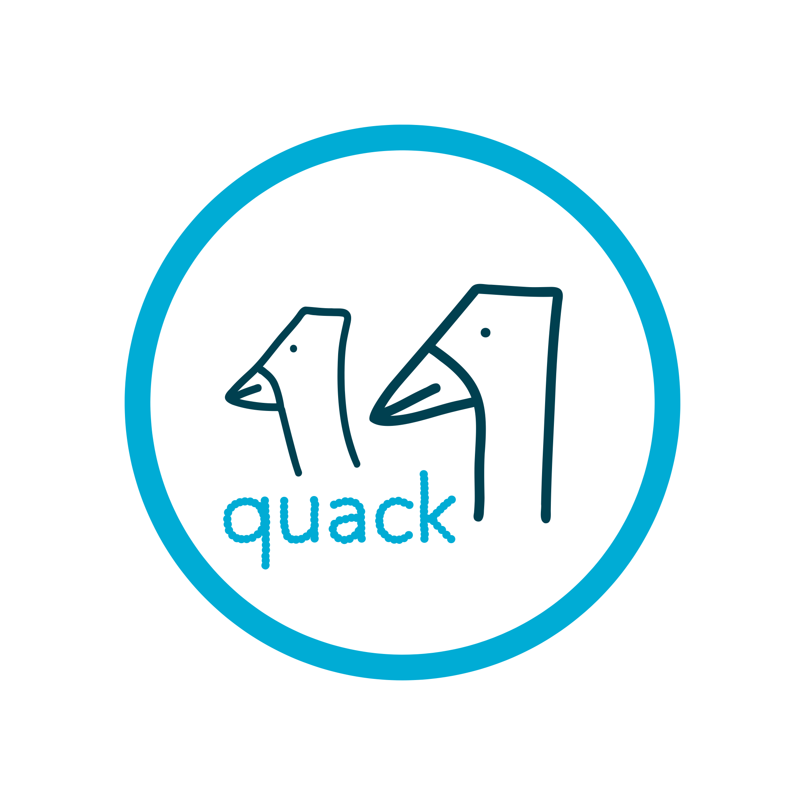

<p align="center">
  
</p>

# quack

`quack` is a terminal UI for viewing active OpenCode sessions and cancelling them.

## Install

### Option 1: Install with Go

```bash
go install github.com/SmolNero/quack/cmd/quack@latest
```

### Option 3: Build from source

```bash
git clone https://github.com/SmolNero/quack.git
cd quack
go build -o quack ./cmd/quack
mv quack /usr/local/bin/quack
```

## Use

Start:

```bash
quack
```

Controls:

- `j` / `k` or arrow keys: move selection
- `r`: refresh
- `c`: cancel selected session
- `q`: quit

## Requirements

- Go 1.24+
- `opencode` installed and available in your `PATH`

## License

Smol Nero License.

---
Smol Nero product.
